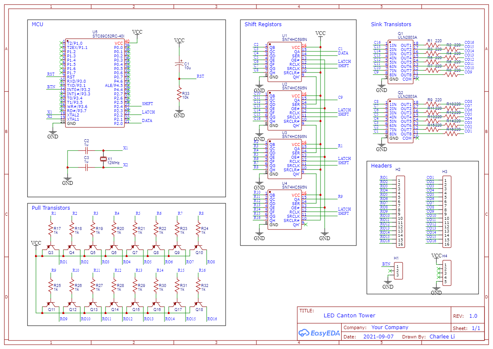
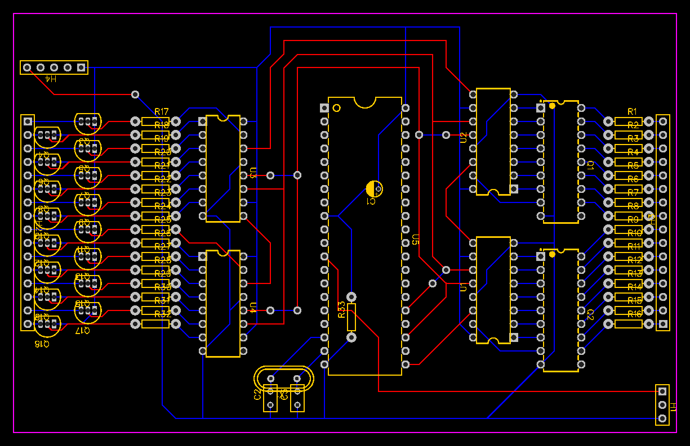

Schematic of the LED Tower Controller
=========================================

The schematic is made with [EasyEDA](https://easyeda.com/).

The PCB is not really for making PCB. Instead, it is designed for soldering manually on perfboards.
The red/blue traces are only used to indicate intersecting traces.

On the actual perfboard, the intersecting traces are soldered in layers, e.g. red traces are soldered about 2-3mm away from the board.

